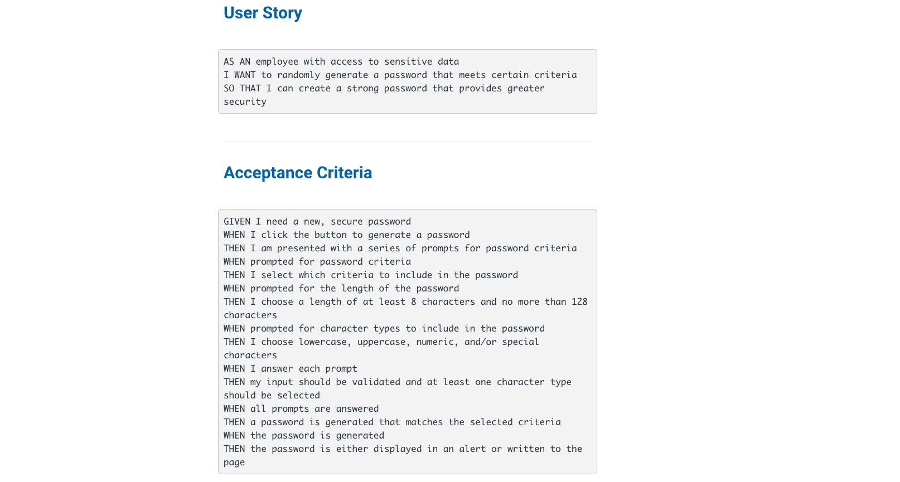
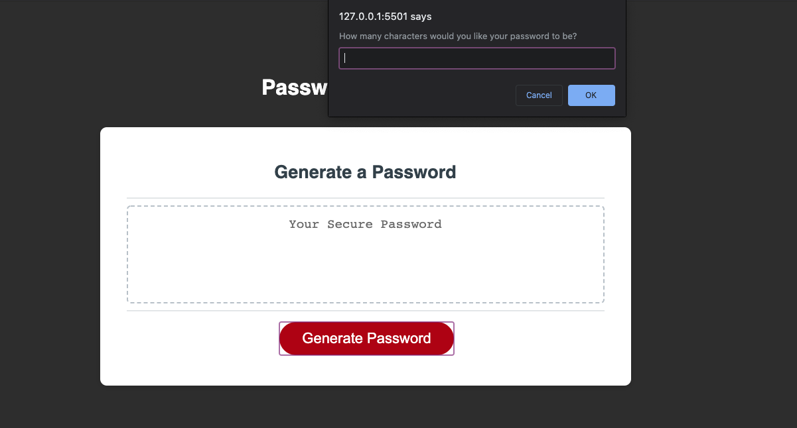
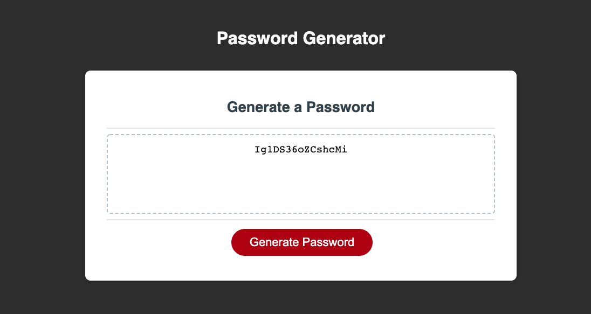

# leggett-password

## Purpose
Build a password generator with Javascript using password length upper case, lower case , numbers, and special characters as parameters based on a series of answers selected by the user. The password generator will compile the data and produce a code in the block that fits the selections by the user.   

## Built with
HTML
CSS
Java

## Website
https://k2gees.github.io/leggett-password/

## Screenshots

### Closing

